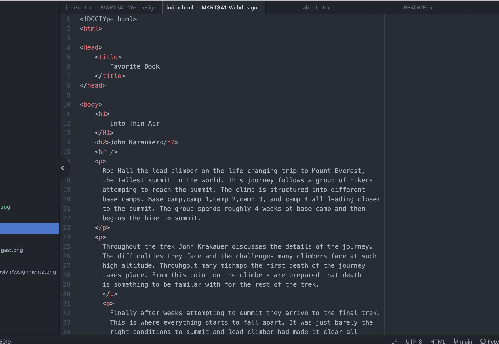

I looked into the food network. Looking back on it the website honestly hasn't changed to much. It features a much more 'clean' look to it than it did previously, but holds a lot of the same concepts that it has had over the past 10 years.
This class has been daunting to take online if I must be honest. I really have to push my self to dive in and make a really hard effort to understand the material. I think the hardest part for me is trusting that I am doing assignments right. Even after watching tutorials and looking at examples I often doubt myself. Although I do feel I am getting a slight better hang of it and getting into a rhythm. Uploading screenshots was a task and a half for me, but after that last video I feel I understand them much better! We will see if this works this time!!

